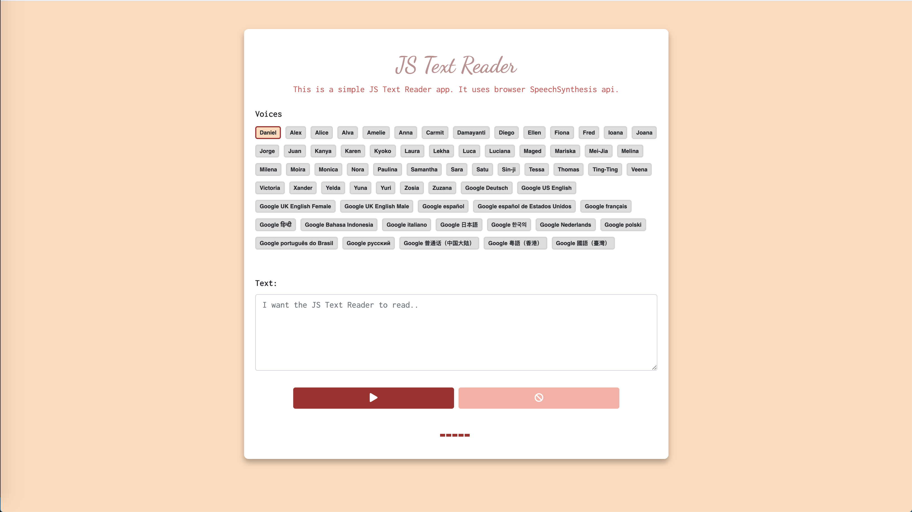

# js-text-reader

<b></bjs-text-reader>js-text-reader</b> is a simlple text reader add. You have to write something in the textarea and select a voice and then just press the button and hear the browser read your text. It was made with browser speech synthesis api.

##### Below is a screenshot for the application:

  

### Getting Started

Just clone the repo and open <b>index.html</b> in browser and yes you now have a cool js-text-reader application.